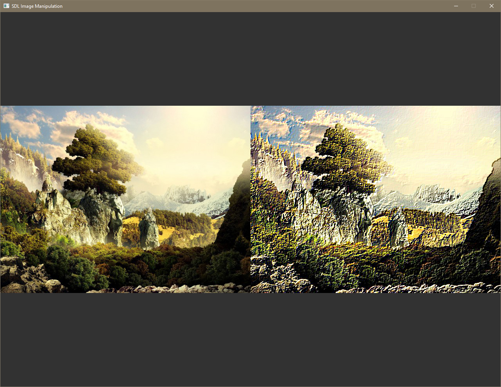
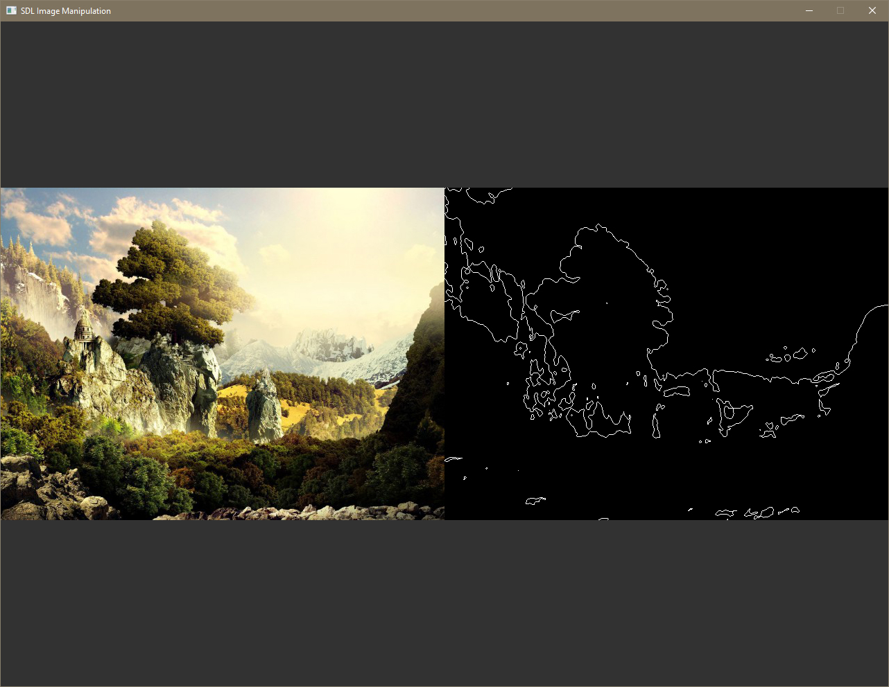
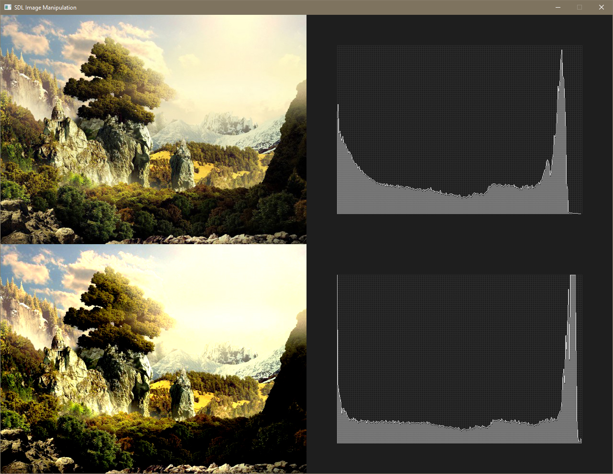

# sdl2_image_processing_library
A portable library of image processing, manipulation, and generation algorithms, used to modify and analyze surfaces before they are converted to textures.

Feel free to use and include your own functions as well. To include in your project, simply copy the 'transform.h' and 'transform.cpp' to your target project destination and include within your main source. Requires SDL2 to use. It is recommended to also include SDL2_ttf and SDL2_image if possible. Enjoy and share your work!

If any bugs or issues are found, please email me at danielfalk.composer@gmail.com so that I can sort it out!

Kernel Operation - Emboss

Trace Binary

Adjust Contrast - Average Histogram Comparison

